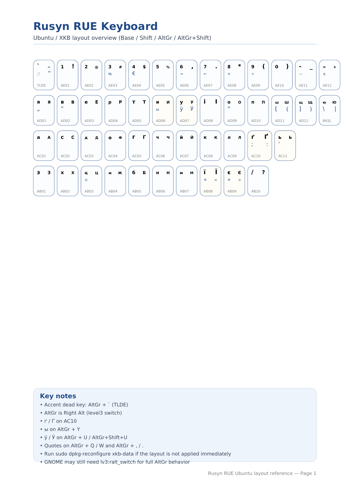

# Rusyn RUE Keyboard Layout

Ubuntu / XKB layout (Carpathian phonetic)  
Linux + Windows support
Modern phonetic keyboard layout for Rusyn language across Linux and Windows.


## Keyboard Layout

<p align="center">
  
</p>

## Особливості

* Фонетична розкладка на базі `ua(phonetic)`
* Повна підтримка русинських літер:

  * **ґ / Ґ**
  * **ы**
  * **ӱ**
* Розширені символи через **AltGr**:

  * № © × ÷ € „ “ —
* Узгоджена логіка з Windows-версією (.klc)
* Встановлення без перезавантаження системи

---

## Встановлення

```bash
git clone https://github.com/YOUR_USERNAME/rue-xkb.git
cd rue-xkb
chmod +x install.sh
sudo ./install.sh
```

---

## Активація розкладки

Після встановлення:

1. Відкрий **Settings → Keyboard → Input Sources**
2. Додай:

   ```
   Rusyn (Carpathian phonetic)
   ```
3. Формат:

   ```
   ('xkb', 'rue+rusyn')
   ```

---

## Важливо: AltGr (3-й рівень)

Якщо AltGr не працює:

```bash
gsettings set org.gnome.desktop.input-sources xkb-options "['lv3:ralt_switch']"
```

---

## Оновлення розкладки (без перезавантаження)

```bash
sudo dpkg-reconfigure xkb-data
```

У більшості випадків розкладка застосовується **миттєво**.

---

## Видалення

```bash
chmod +x uninstall.sh
sudo ./uninstall.sh
```

---

## Що робить install.sh

* Копіює `symbols/rue`
* Додає layout у:

  * `/usr/share/X11/xkb/rules/evdev.lst`
  * `/usr/share/X11/xkb/rules/evdev.xml`
* Робить backup змінених файлів
* Оновлює XKB через:

  ```
  dpkg-reconfigure xkb-data
  ```

---

## Що робить uninstall.sh

* Видаляє `symbols/rue`
* Прибирає записи з `evdev.lst` і `evdev.xml`
* Залишає стандартний:

  ```
  rs(rue) = Pannonian Rusyn
  ```
* Оновлює XKB

---

## Після видалення (важливо)

Після видалення розкладки в GNOME може залишатися неробочий запис "Rusyn".

Це нормальна поведінка, тому що GNOME зберігає список джерел вводу
у власних налаштуваннях користувача, а не в системі XKB.

### Як прибрати:

Відкрий:

**Settings → Keyboard → Input Sources**

і видали:

**Rusyn (Carpathian phonetic)**

---

### Або через термінал:

Перевір поточні джерела вводу:

```bash
gsettings get org.gnome.desktop.input-sources source

---

## Сумісність

Перевірено на:

* Ubuntu 24.04
* Ubuntu 26.04 (development)

Очікується робота на:

* Debian
* Linux Mint
* інші Debian-based системи

---

## Примітки

* Не потребує перезавантаження
* Працює під Wayland і X11
* Може вимагати повторного додавання розкладки в GNOME після змін

---

## Ліцензія

MIT License

---

## Автор

RUE Rusyn layout (Carpathian / Lemko variant)

## Windows

Файли для Windows знаходяться в папці: windows/

### Встановлення

1. Відкрий папку `windows/installer`
2. Запусти `.exe`
3. Додай розкладку в налаштуваннях Windows

### Файли

* `.klc` — джерело розкладки
* `.exe` — готовий інсталятор
* PDF — схема клавіатури

---

